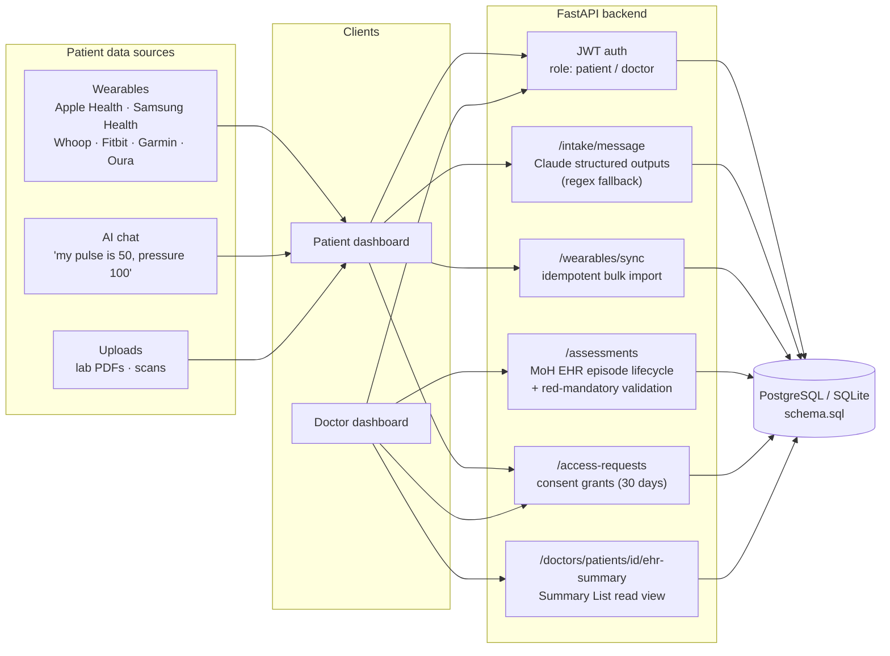
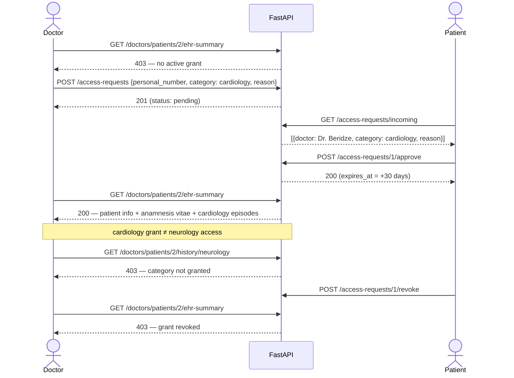
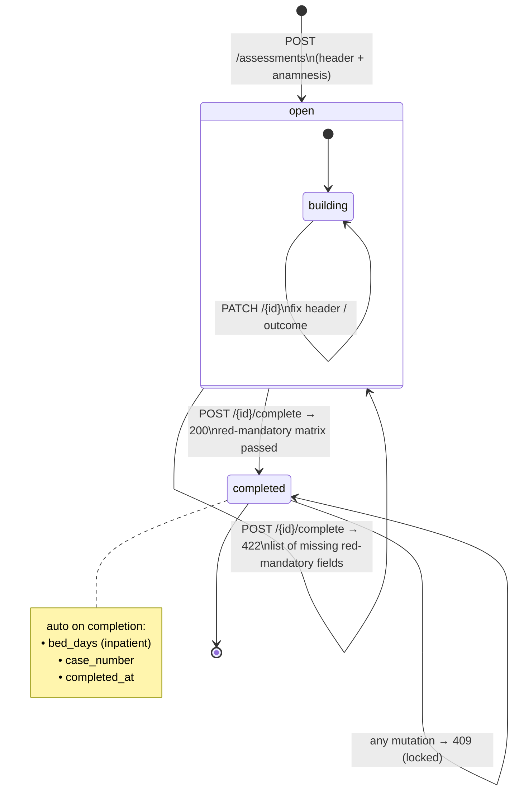
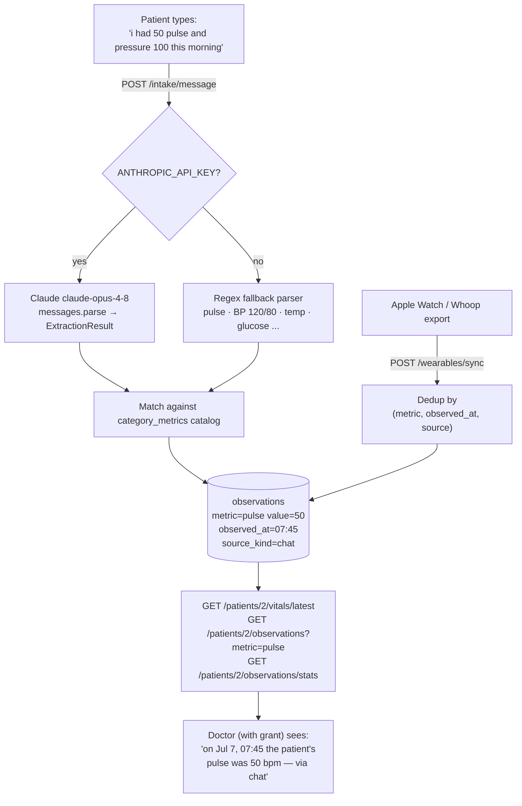

# Architecture & Flow Diagrams

All diagrams are Mermaid — GitHub renders them inline.

## 1. System overview

## 2. Database schema (ER)

```mermaid
erDiagram
    users {
        int id PK
        string role "patient | doctor"
        string email UK
        string full_name
        string personal_number "Georgian ID"
        date date_of_birth
        string blood_group
        string address_region
        string address_actual
        string specialty "doctors only"
    }

    categories {
        int id PK
        string code UK "cardiology, neurology, ..."
        string name
    }

    assessments {
        int id PK
        int patient_id FK
        int doctor_id FK
        int category_id FK
        string episode_type "inpatient | day_hospital | emergency_outpatient | outpatient"
        string status "open | completed"
        string medical_record_number "red"
        datetime visit_date "admission - red"
        datetime first_visit_end_at "red at completion"
        datetime discharge_at "red at completion"
        string case_number "auto"
        string transportation_type "red: stationary"
        string hospitalization_type "red"
        text complaints "red"
        bool hospitalized_for_this_disease "red: inpatient"
        string episode_result "red"
        string disease_outcome "red unless death"
        int bed_days "auto: inpatient"
    }

    assessment_diagnoses {
        int id PK
        int assessment_id FK
        string kind "preliminary | clinical | final_main | final_comorbidity | final_complication"
        string icd10_code "red"
        datetime established_at "red: clinical"
        string disease_course "red: final_*"
        string refined_icd10
    }

    assessment_visits {
        int id PK
        int assessment_id FK
        datetime started_at "red"
        datetime ended_at "red, max 24h"
        text comment
    }

    assessment_activities {
        int id PK
        int assessment_id FK
        string activity_type "21 types: labs, consults, surgery, discharge_*"
        string name "NCSP / lab / drug"
        string icd10_code
        string care
        datetime started_at
        datetime ended_at
        datetime result_date
        text result_note
        json details "specialty, blood_component, quantity, ..."
    }

    assessment_images {
        int id PK
        int assessment_id FK
        string file_path "X-ray, echo, DICOM, PDF"
    }

    access_requests {
        int id PK
        int doctor_id FK
        int patient_id FK
        int category_id FK
        string status "pending | approved | denied | revoked"
        datetime expires_at "+30 days on approval"
    }

    profile_items {
        int id PK
        int patient_id FK
        string item_type "allergy, chronic_condition, past_disease, blood_transfusion, pregnancy, ..."
        string name
        string icd10
        date occurred_on
    }

    observations {
        int id PK
        int patient_id FK
        int category_id FK
        string metric "pulse, steps, hba1c, ..."
        float value_num
        datetime observed_at "real measurement time"
        string source_kind "chat | wearable | manual"
        string source_label "Apple Health, AI intake, ..."
    }

    category_metrics {
        int id PK
        int category_id FK
        string code UK "maps free text to category"
        string unit
        float range_low
        float range_high
    }

    patient_documents {
        int id PK
        int patient_id FK
        string file_path
    }

    calendar_events {
        int id PK
        int patient_id FK
        string kind "appointment | reminder | medication"
        date event_date
    }

    users ||--o{ assessments : "as patient"
    users ||--o{ assessments : "as doctor"
    categories ||--o{ assessments : ""
    assessments ||--o{ assessment_diagnoses : ""
    assessments ||--o{ assessment_visits : ""
    assessments ||--o{ assessment_activities : ""
    assessments ||--o{ assessment_images : ""
    users ||--o{ access_requests : "doctor asks"
    users ||--o{ access_requests : "patient decides"
    categories ||--o{ access_requests : "scoped to"
    users ||--o{ profile_items : ""
    users ||--o{ observations : ""
    categories ||--o{ observations : "tagged"
    categories ||--o{ category_metrics : ""
    users ||--o{ patient_documents : ""
    users ||--o{ calendar_events : ""
```

## 3. Consent flow (doctor ⇄ patient)

## 4. EHR episode lifecycle (MoH write spec)

## 5. Patient data pipeline (why timestamps matter)

